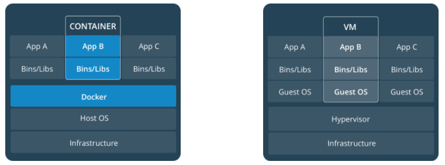

<!-- TOC -->

- [Docker 快速指南](#docker-%E5%BF%AB%E9%80%9F%E6%8C%87%E5%8D%97)
    - [Orientation](#orientation)
        - [概念](#%E6%A6%82%E5%BF%B5)
            - [Docker 的优点](#docker-%E7%9A%84%E4%BC%98%E7%82%B9)
            - [容器和镜像](#%E5%AE%B9%E5%99%A8%E5%92%8C%E9%95%9C%E5%83%8F)
        - [容器和虚拟机](#%E5%AE%B9%E5%99%A8%E5%92%8C%E8%99%9A%E6%8B%9F%E6%9C%BA)
    - [Containers](#containers)
        - [Dockerfile](#dockerfile)
        - [创建并运行一个镜像](#%E5%88%9B%E5%BB%BA%E5%B9%B6%E8%BF%90%E8%A1%8C%E4%B8%80%E4%B8%AA%E9%95%9C%E5%83%8F)
        - [共享镜像](#%E5%85%B1%E4%BA%AB%E9%95%9C%E5%83%8F)
    - [Services](#services)
    - [Swarms](#swarms)
    - [Stacks](#stacks)
    - [Deploy](#deploy)
    - [常用命令行](#%E5%B8%B8%E7%94%A8%E5%91%BD%E4%BB%A4%E8%A1%8C)
    - [资料](#%E8%B5%84%E6%96%99)

<!-- /TOC -->

# Docker 快速指南

## Orientation

### 概念

Docker 是一个让开发者或系统管理员使用容器来**开发**、**部署**和**运行**应用的平台。

#### 容器和镜像

镜像是一个可执行的包，这个包中含有运行一个应用所需要的一切：代码、运行环境、库、环境变量、配置文件。

容器是一个镜像的实例。镜像和容器的关系就好像面向对象语言中类和对象的关系。

### 容器和虚拟机

一个容器在Linux上本地运行，并与其他容器共享主机的内核。它运行一个独立的进程，不占用任何其他可执行文件的内存，使其轻量化。

相比之下，虚拟机（VM）运行一个完整的“客户”操作系统，通过虚拟机管理程序虚拟访问主机资源。一般来说，虚拟机提供的环境比大多数应用程序需要的资源更多。



## Containers

在以往的开发中，运行一个应用，首先需要准备好它的运行环境。

使用 Docker，可以将应用的运行环境（如 JDK、Maven等）打包为一个可移植的镜像。然后，运行应用的同时，运行基础运行环境镜像。

这种可移植的镜像定义在一个叫做 `Dockerfile` 的文件。

### Dockerfile

Dockerfile定义了容器内环境中发生的事情。访问网络接口和磁盘驱动器等资源是在此环境中虚拟化的，与系统的其余部分隔离，因此您需要将端口映射到外部世界，并明确要将哪些文件“复制”到那个环境。但是，在完成这些之后，您可以预期，在此Dockerfile中定义的应用程序构建在运行时的行为完全相同。

### 创建并运行一个镜像

（1）创建一个目录

```sh
mkdir -p /home/zp/dockerdemo
cd /home/zp/dockerdemo
```

（2）定义一个 Dockerfile

```docker
# Use an official Python runtime as a parent image
FROM python:2.7-slim

# Set the working directory to /app
WORKDIR /app

# Copy the current directory contents into the container at /app
ADD . /app

# Install any needed packages specified in requirements.txt
RUN pip install --trusted-host pypi.python.org -r requirements.txt

# Make port 80 available to the world outside this container
EXPOSE 80

# Define environment variable
ENV NAME World

# Run app.py when the container launches
CMD ["python", "app.py"]
```

> 代理服务器在启动并运行后可以阻止与您的网络应用程序的连接。如果您位于代理服务器的后面，请使用 `ENV` 命令为您的代理服务器指定主机和端口，将以下行添加到 Dockerfile 中：
>
> ```docker
> # Set proxy server, replace host:port with values for your servers
> ENV http_proxy host:port
> ENV https_proxy host:port
> ```

（3）创建一个 app

这里以创建一个 python 应用为例。

在 Dockerfile 同目录下新建 `requirements.txt` 文件和 `app.py` 文件。

创建一个 `requirements.txt` 文件

```
Flask
Redis
```

创建一个 `app.py` 文件

```py
from flask import Flask
from redis import Redis, RedisError
import os
import socket

# Connect to Redis
redis = Redis(host="redis", db=0, socket_connect_timeout=2, socket_timeout=2)

app = Flask(__name__)

@app.route("/")
def hello():
    try:
        visits = redis.incr("counter")
    except RedisError:
        visits = "<i>cannot connect to Redis, counter disabled</i>"

    html = "<h3>Hello {name}!</h3>" \
           "<b>Hostname:</b> {hostname}<br/>" \
           "<b>Visits:</b> {visits}"
    return html.format(name=os.getenv("NAME", "world"), hostname=socket.gethostname(), visits=visits)

if __name__ == "__main__":
    app.run(host='0.0.0.0', port=80)
```

（4）构建应用

创建一个 Docker 镜像，执行命令：

```sh
docker build -t friendlyhello .
```

查看 Docker 镜像，执行命令：

```sh
$ docker image ls

REPOSITORY            TAG                 IMAGE ID
friendlyhello         latest              326387cea398
```

（5）运行 app

使用 `-p` 将您的机器的端口4000映射到容器的已发布端口80

```sh
docker run -d -p 4000:80 friendlyhello
```

然后，可以访问 http://localhost:4000

### 共享镜像

（1）注册登录

在 [cloud.docker.com](https://cloud.docker.com/) 注册账户，然后使用 Docker ID 登录。

```sh
docker login
```

> 注册 Docker ID ，要访问 google ，国内无法访问。要命。

（2）给镜像打标签

```
docker tag image username/repository:tag
```

例：

```
docker tag friendlyhello john/get-started:part2
```

（3）发布镜像

```
docker push username/repository:tag
```

（4）从远程仓库拉取并运行镜像

```
docker run -p 4000:80 username/repository:tag
```

## Services

## Swarms

## Stacks

## Deploy

## 常用命令行

```sh
docker # 列出所有 Docker 命令

docker version    # 显示 docker 版本
docker info       # 显示 docker 信息

docker build -t friendlyhello .  # 使用当前目录下的 Dockerfile 创建 Docker 镜像
docker run -p 4000:80 friendlyhello  # 运行 "friendlyname" ，并映射端口 4000 到 80
docker run -d -p 4000:80 friendlyhello         # 同样的事，但是使用分离的模式

docker container --help            # 列出 docker container 相关命令
docker container ls                                # 列出所有运行的容器
docker container ls -a             # 列出所有的容器
docker container stop <hash>           # 优雅的停止所有指定的容器
docker container kill <hash>         # 强制停止所有指定的容器
docker container rm <hash>        # 从本机中溢出指定的容器
docker container rm $(docker container ls -a -q)         # 移除所有容器

docker image --help                # 列出 docker image 相关命令
docker image ls -a                             # 列出本机中所有的镜像
docker image rm <image id>            # 从本机中溢出指定的镜像
docker image rm $(docker image ls -a -q)   # 移除本机中所有镜像
docker login             # 使用您的 Docker ID 登录以从 Docker Hub push 和 pull 图像。
docker tag <image> username/repository:tag  # 标记 <image> 以上传到注册中心
docker push username/repository:tag            # 上传标记过的镜像到注册中心
docker run username/repository:tag                   # 运行一个注册中心上的镜像
```

## 资料

* https://docs.docker.com/get-started/
